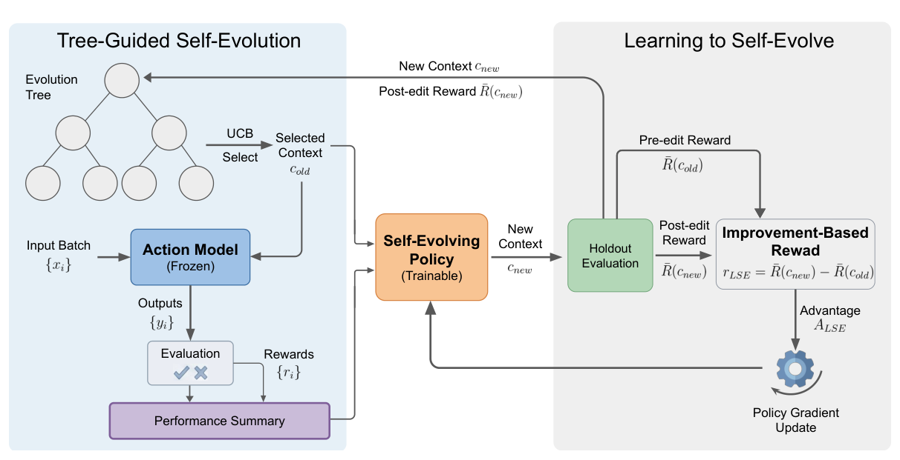
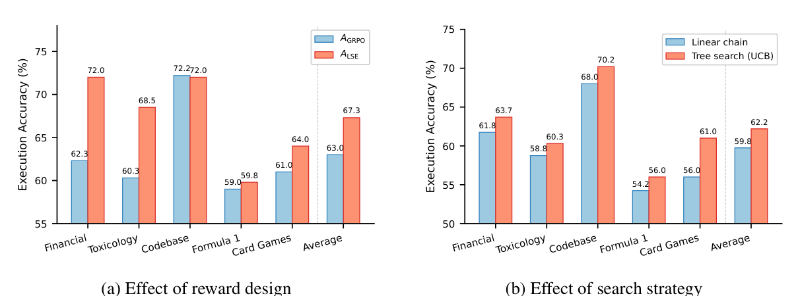

# Learning to Self-Evolve

最近在看 test-time adaptation / self-improving LLM 这条线，读得越多越有一个感受：现在大多数所谓的自我进化，其实都只是在**借用模型预训练时顺带学到的反思能力**，具体而言往往是让模型针对失败的case进行反思，从而迭代prompt。而没有人真正把进化这件事当成一个显式的训练目标。Learning to Self-Evolve（LSE）最打动我的，恰恰是它捅破了这层窗户纸——它不满足于让模型会改自己的 prompt，而是干脆用 RL **专门训练一个会自我进化的策略**。

这篇文章主要整理我读 Learning to Self-Evolve (LSE)（Mila / University of Montreal / Snowflake）时的一些思考。

## 方法主线：单步 RL 迭代 Self-Evovle Model

一句话概括，作者想训练一个 self-evolving policy：它在测试阶段观察模型在一批已见问题上的表现反馈，然后据此改写模型的 context，让模型在新问题上做得更好。关键区别在于——这个改写策略不是靠仅推理实现，而是被 RL 显式训练过的。

### 核心问题

现在 LLM 的学习基本止步于训练结束：部署以后，无论它在某个领域已经解过多少题，用的都还是同一套策略，新的session里面积累的经验会被清零。

已有的 test-time self-evolution 方法（各种 reflection / prompt refinement）都有一个共同短板：

- 它们完全依赖模型自身现成的推理能力去分析反馈、提出更好的 context
- 模型从来没有被专门训练去做自我改进这件事
- 而自我进化其实内含了一个 RL 结构——要做失败与成功的归因、要预判一次修改会怎样影响下游任务、要在从已有的经验和尝试新的策略之间权衡，这很难模型仅靠自然语言推理把这三件事做完

### 核心方法

整条路线可以拆成三块：

1. 定义好进化问题形式化，并选 prompt-based 的进化方法：策略 $\pi_\theta$ 由参数 $\theta$ 和 context $c$ 共同决定。进化函数 $f$ 有两种做法——gradient-based（直接改 $\theta$）和 prompt-based（冻结 $\theta$、只改 $c$）。作者选后者：无需测试时算梯度，希望减少持续迭代中的遗忘，还把进化问题转成了一个可以被继续训练的自然语言推理任务。
2. improvement-based reward（LSE 的核心）：直接优化 $T$ 步累积奖励代价太高（长时序难归因）。作者把它简化到单步，策略只做一次 context 编辑 $c_1 = f_\psi(c_0, S_0)$，并用性能提升而非绝对分数来奖励它
   $$A_{\text{LSE}} = \bar{R}(c_1) - \bar{R}(c_0)$$
   妙的地方在于：pre-edit reward $\bar{R}(c_0)$ 在策略动作之前就已知（等价于什么都不改），所以它可以直接当 baseline 用，不需要像GRPO为每个 prompt 做多次 rollout 的 group normalization。它作为 control 信号可以给出更稳的 policy-gradient 信号。
3. UCB explore-vs-exploit：测试时用一棵 evolution tree 组织进化过程，靠 UCB 在树上选节点（平衡 explore / exploit），act → evaluate → evolve，在打分后把新 context 作为子节点挂回去，最后返回全树最优 context。

左半边是测试时的 tree-guided 循环：UCB 从 evolution tree 选出 context，冻结的 action model 跑一批问题，评测结果汇成 performance summary 交给 self-evolving policy 改写。右半边是训练：post-edit reward 减去动作前就已知的 pre-edit reward 得到 improvement-based reward，拿去做 policy gradient。图里唯一被训练的，就是中间橙色的 Self-Evolving Policy。

**个人思考**
作者的 **improvement-based advantage** $A_{\text{LSE}} = \bar{R}(c_1) - \bar{R}(c_0)$ 是我觉得最关键的一个设计。它把自我进化变成了一个有明确奖励信号、可以用 policy gradient 稳定训练的 contextual bandit 问题。再配上 tree search（UCB）来提供多样的起始状态 $c_0$——因为测试时策略要改进自己前几轮产出的 context，训练分布如果只用种子 prompt 就会 mismatch——整套东西就自洽了。

## 论文的其他亮点

### 小模型打赢前沿大模型

最抢眼的结果是：一个 **4B 参数**的模型经 LSE 训练后，作为 self-evolving policy，超过了由 GPT-5 和 Claude Sonnet 4.5 驱动的自我进化策略，也超过 GEPA、TextGrad 这类专门的 prompt 优化方法。action policy 统一用 Qwen3-4B-Instruct，公平对比：

- **Text-to-SQL (BIRD)**，execution accuracy 均值：LSE **67.3** vs GPT-5 65.2 / Claude Sonnet 4.5 64.5 / TextGrad 63.1 / GEPA 62.8 / 种子 prompt 57.2
- **通用问答 (MMLU-Redux)**，accuracy 均值：LSE **73.3** vs GEPA 73.0 / GPT-5 72.5 / Claude Sonnet 4.5 72.0 / 种子 prompt 67.6

### 可迁移：训好的策略能去指导别的模型

训练好的 self-evolving policy 可以不经额外训练就迁移去指导其他模型。这点很重要——它说明「自我进化」确实被学成了一种相对通用的技能，而不是只针对某一个 action model 过拟合出来的。

### 干净的消融

两个 ablation 把关键设计都验证了：(a) improvement-based reward $A_{\text{LSE}}$ 明显优于用 GRPO group-based advantage 的 $A_{\text{GRPO}}$；(b) tree search（UCB）优于只延伸最近节点的 linear chain。

左图 reward 设计：换成 $A_{\text{LSE}}$ 后 BIRD 均值 63.0 → 67.3。右图搜索策略：即便用未训练的 Qwen3-4B 当 policy，tree search（UCB）也稳定优于 linear chain（59.8 → 62.2）——一次坏编辑不会一条道走到黑，UCB 能回退到更高分的祖先节点。

## 总结

如果只把它当成又一个 prompt 优化方法，我觉得会看小它。LSE 真正的意义在于，它把 self-evolution 从一种被动涌现的能力，重新定义成一个可以被 RL 显式训练、可以被迁移复用的技能——而且用一个 4B 模型证明了这条路能打赢前沿大模型驱动的同类方案。

对关心 test-time adaptation、self-improving agent、乃至更广义部署后还能持续变强的系统的读者来说，最值得记住的不是某个分数，而是那句底层判断：既然自我进化内含一个 RL 结构，那就应该真的用 RL 去训它。

## 参考

- [代码仓库](https://github.com/chenyn66/learning-to-self-evolve)
- [论文原文链接](https://arxiv.org/abs/2603.18620)
