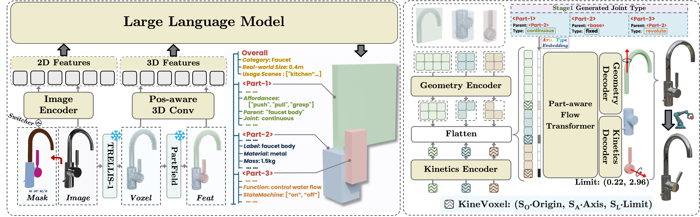

# PhysForge：为交互式虚拟世界生成 physics-grounded 3D 资产

最近连续看了两篇气质很接近、但落点不太一样的工作：一篇重点放在从单图生成 simulation-ready asset，另一篇则继续把 **physical realism、functional realism、interactive world** 往同一个框架里收。PhysForge 给我的第一印象就是，它想做的已经不只是“一个能进仿真器的物体”，而是一个在虚拟世界里 **真的带着物理语义、功能语义和交互语义** 的对象。

读下来最明显的感受是，很多 3D generation 论文还停在“看起来像”，而 PhysForge 已经把目标推到了“放进世界里，用起来也像”。

这篇文章主要整理我读 **PhysForge: Generating Physics-Grounded 3D Assets for Interactive Virtual World** 时的一些想法。

## 方法主线：先规划物理蓝图，再生成 3D 资产

一句话概括，作者要做的是：从图像输入出发，先规划出对象的 **Hierarchical Physical Blueprint**，再依照这套蓝图生成带有几何、纹理和运动学参数的 3D 资产。

和很多端到端 3D 方法相比，最关键的区别在于：它没有把“图像 → 3D”当成唯一目标，而是明确在中间插入了一层 **physical planning**。

### 核心问题

作者真正想解决的，并不是“怎么再生成一个漂亮的 3D mesh”，而是一个更贴近应用的问题：

> **怎样才能生成真正适合交互式世界使用的资产？**

现有系统在 interactive asset generation 上，通常会卡在这些地方：

- 只建模静态几何，缺少功能和物理约束
- 即便有可动部件，也没有清晰的 parent-child 结构与 joint 参数
- material、mass、state、affordance 这类高层物理语义很难统一表达
- 生成链路缺少显式规划，因此“能交互”这件事往往不够可靠

### 核心方法

整套方案是一个非常清晰的两阶段框架：

1. **Stage 1：物理蓝图规划**  
   先让 VLM 扮演 **physical architect**，根据输入图像生成分层的物理蓝图。  
2. **Stage 2：资产生成**  
   再让 physics-grounded diffusion model 依据蓝图生成几何、纹理和运动学参数。  
3. **关键桥梁：KineVoxel Injection**  
   作者提出 KVI 机制，把运动学相关信息更稳定地注入生成过程中，使最终结果不仅形状对，而且关节与运动范围也更可控。

## 从“生成 3D”到“生成可交互世界里的对象”

对我而言，最值得细看的就是这一部分。它不再把 3D 资产看成一个孤立的 mesh，而是把它视为虚拟世界中的对象节点：有部件、有层级、有功能、有状态，也可能和 agent / robot 发生真实交互。

### 为什么这点重要

对于 embodied AI、virtual world、interactive simulation 来说，一个对象的价值常常不在于“长什么样”，而在于：

- 它能不能动
- 它为什么能动
- 它会以什么方式动
- 它能提供什么交互 affordance
- 它进入世界后，是否还保留这些物理和功能语义

PhysForge 的贡献就在这里：这些因素不是后处理才补上的，而是被前置到了资产生成本身。

**解决方案**

论文里的 **Hierarchical Physical Blueprint**，是我觉得最关键的概念之一。它并不是一个简单标签，而是一层结构化中间表示，里面包括：

- part bounding boxes
- parent-child structure
- joint types
- material 与 mass
- function、state machines、affordances

这张图很能体现 PhysForge 的思路：先用一个真正会“理解对象物理组织方式”的 planner，把对象拆成一套可解释的 physical blueprint；接着再把这套 blueprint 交给生成模型，把 geometry、texture、kinematics 一起生成出来。

**个人思考**

在我看来，这比单纯比较“3D 生成效果好不好”更重要。只要对象要进入可交互环境，representation 就不能只服务渲染，还得服务控制、仿真、推理和任务执行。PhysForge 的价值，正在于它开始认真把 **对象的物理组织结构** 当成生成任务的一等公民。

## 论文的其他亮点

### PhysDB 数据集

论文还提出了 **PhysDB**，规模达到 **150,000** 个资产，并带有 **four-tier physical annotations**。无论是量级还是标注粒度，都说明作者不只是做了一个方法，也在补 physics-grounded 3D asset 这条路线的数据基础设施。

### 两阶段解耦设计

我很喜欢它“先规划、再生成”的解耦方式。很多端到端方法的问题是：模型内部一旦没有清晰结构，最后即使生成结果看起来不错，也往往既难解释、又难控制。PhysForge 用 blueprint 把这一层显式化了，这件事非常关键。

### 应用导向很明确

项目页里明确展示了三个使用方向：

- Robotic Simulation
- Virtual Worlds
- Agent-Environment Interaction

这说明它并不是只想在 3D benchmark 上刷分，而是希望生成结果能直接进入下游交互场景。

## 这篇工作还没有完全解决的问题

当然，PhysForge 也没有把问题彻底做完。它确实很强，但在我看来，这更像是把“physics-grounded asset generation”往前推了一大步，而不是已经把整条路线彻底打通。

### 蓝图质量仍然决定上限

这是一个非常典型的两阶段方法，因此第一阶段生成的 **Hierarchical Physical Blueprint**，几乎直接决定了后续资产生成的上限。只要 blueprint 在部件划分、层级关系、关节类型或功能语义上出错，后面的生成模型大概率也只能把这个错误“高保真地做出来”。

换句话说，问题是被拆清楚了，但误差传播并没有因此消失。

### 单图设定仍然有信息缺口

从单张图像恢复一个带有丰富物理语义的对象，本身就是一个欠定问题。遮挡部分、背面结构、内部连接关系、真实材料与质量分布，很多信息其实根本不会直接出现在图像里。

所以即使 blueprint 很强，这个任务依然不可避免地包含了大量基于先验的推断。

### 物理语义比几何更难评估

几何好不好，至少还有相对明确的指标和视觉比较方式；但 material、mass、state、affordance、functional plausibility 这类东西，评估起来要困难得多。

也就是说，论文很可能已经把“该预测什么”定义得比较清楚了，但“怎样可靠地评估这些物理语义是不是真的对”仍然是开放问题。

### 从 asset-ready 到 task-ready 之间还有距离

能生成 physics-grounded asset，并不等于这些资产已经在机器人任务、agent planning 或复杂交互仿真里得到了充分验证。真正到了下游系统里，还会遇到控制稳定性、接触精度、动力学真实性、任务成功率等更苛刻的问题。

所以我更愿意把 PhysForge 看成一个很像样的起点：它把“可交互 3D 资产”做成了一个明确目标，但要稳定支撑大规模 embodied tasks，后面应该还需要更多系统级验证。

## 总结

如果说很多 3D 生成工作解决的是“怎么做出一个像样的对象”，那 PhysForge 更想回答的是：**怎么做出一个在交互式世界里有物理意义、有功能意义、还能被 agent 使用的对象。**

最打动我的，并不是某个单独模块有多新，而是它把 **physical blueprint planning、asset generation、downstream interaction** 这几层关系理顺了。

对关心 embodied world model、机器人仿真、交互式虚拟环境的人来说，这篇文章很值得看，因为它真正把“对象不仅要被看见，还要能被使用”写进了方法设计里。

## 参考

- [Project Page](https://hku-mmlab.github.io/PhysForge/)
- [论文原文链接](https://arxiv.org/abs/2605.05163)
